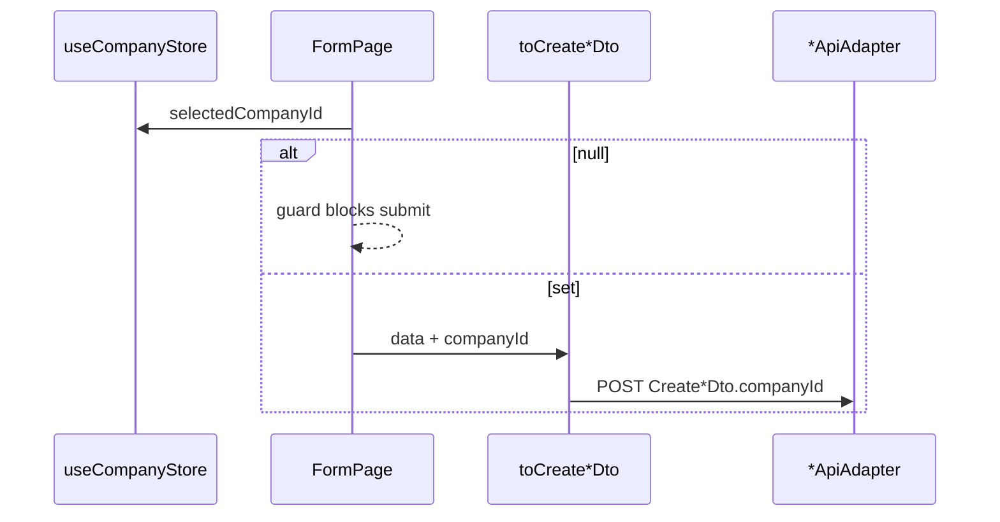
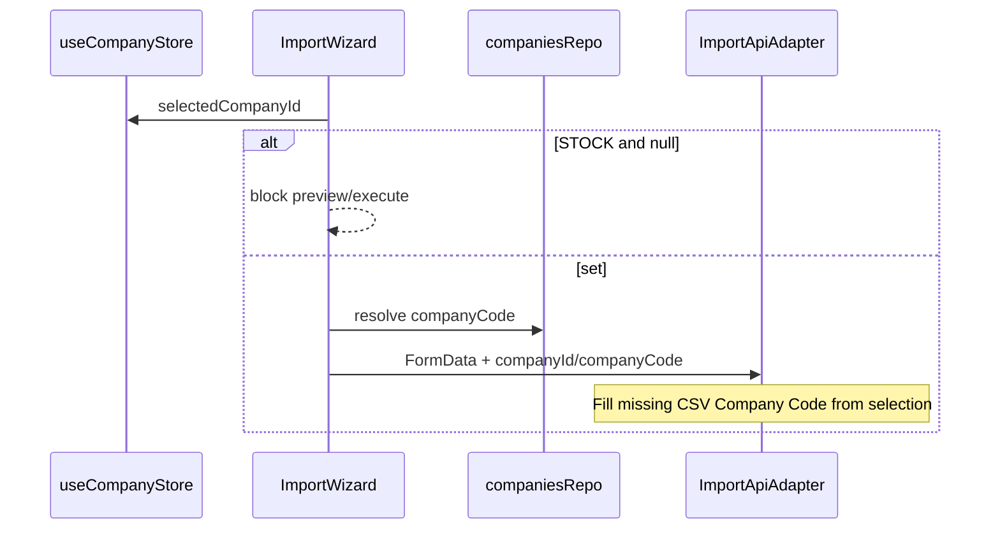

# Design: Company-Scoped Stock UI

## Technical Approach

Inject `useCompanyStore.selectedCompanyId` as header/inventory company (Approach 1). Keep hexagonal boundaries: domain/DTO/mapper carry `companyId`; adapters on the wire; presentation fail-closes on `null` (“All”). Matches BE `company-scoped-stock` (stock/header company, not `product.companyId`).

## Architecture Decisions

| Decision | Options | Tradeoff | Choice |
|----------|---------|----------|--------|
| Create header | Store inject / per-form Select / omit | Minimal UI vs clarity | **Store** via `toCreate*(data, companyId)` |
| “All” / null | Fail-closed / silent / toast | Prevents BE 400 | **Guard**: disable submit + Alert + selector CTA |
| Stock identity | Map `companyId` + composite id | Avoid SKU/WH collisions | **Expose**; fallback `${productId}:${warehouseId}:${companyId}:${i}` |
| `findByProductAndWarehouse` | Optional `companyId` / ignore | Ambiguous post-split | **Optional query arg** on port + adapter |
| Transfer list | Wire store / leave open | BE header filter | **Inject when non-null** → `TransferFilters.companyId` |
| Inventory pickers | Drop ownership filter / keep | Shared catalog | **Omit** `companyId` on doc forms; product admin keeps it |
| STOCK import | FormData / CSV `companyCode` | BE ignores unknown FormData today | **Guard + resolve code + FormData**; **enrich missing CSV Company Code**; BE default field = follow-up |
| Doc response `companyId` | Map now / later | Lists already filter | **Stock required**; create responses optional |

## Layers Affected

```
presentation → forms/lists/wizard + CompanyRequiredGuard; toCreate*(…, companyId)
application  → Create*Dto; Stock DTO/mapper; TransferFilters; ImportRepositoryPort
infrastructure → *ApiAdapters (body/query/FormData/map)
domain → StockProps.companyId
```

**Ports:** `findByProductAndWarehouse(..., companyId?)`; `ImportRepositoryPort.preview/execute(..., companyId?)`.

**Hierarchy:** `*FormPage` → `CompanyRequiredGuard` → form (disabled when null).

## Data Flow





Stock list: API `companyId` → `StockMapper` → row key `entity.id`.

Lists (existing): inject filter `companyId` **only when** store non-null.

## File Changes

| File | Action | Description |
|------|--------|-------------|
| `stock.entity/dto/mapper` + port + `stock-api.adapter` | Modify | `companyId` map; composite id; lookup query |
| `transfer.dto` + adapter + `transfer-list.tsx` | Modify | Filter + create `companyId` |
| `CreateSale/Movement/Transfer/Return` DTOs + schemas | Modify | Required header; `toCreate*(data, companyId)` |
| sale/movement/transfer/return form pages | Modify | Guard + inject; pickers drop ownership filter |
| `company-required-guard.tsx` | Create | Shared Alert/disable |
| imports port/adapter/hooks/wizard | Modify | STOCK gate + FormData/CSV bind |
| `messages/{en,es}.json` | Modify | Guard + import copy |
| `tests/**` mappers/schemas/list/import/guard | Create/Modify | Vitest per PR slice |

## Interfaces / Contracts

```ts
toCreateSaleDto(data: CreateSaleFormData, companyId: string): CreateSaleDto
// Create*Dto.companyId: string (required on create wire)
```

## Testing Strategy

| Layer | What | Approach |
|-------|------|----------|
| Unit | Mapper/schema/adapters/`FormData` | Existing `*.spec.ts` + new cases |
| Component | Guard, TransferList merge, STOCK wizard block | RTL + mocked store |
| Quality | Full suite | `vitest run` + `tsc --noEmit` |

No new E2E in v1.

## PR Slice Alignment

1. **PR1** — Stock identity + transfer list filters + lookup `companyId`
2. **PR2** — Create inject + `CompanyRequiredGuard` + i18n
3. **PR3** — Shared-catalog inventory pickers
4. **PR4** — STOCK import bind

Chained; each green alone. `400-line budget risk: High`.

## Migration / Rollout

No FE migration. Ship after BE. Incomplete inject → create failures. Do not touch `meli-full-warehouse-ui`.

## Open Questions

- [ ] BE honor multipart default company on STOCK? Until then CSV enrichment is the reliable bind
- [ ] Movement/Transfer imports in v1? (proposal: STOCK only)
