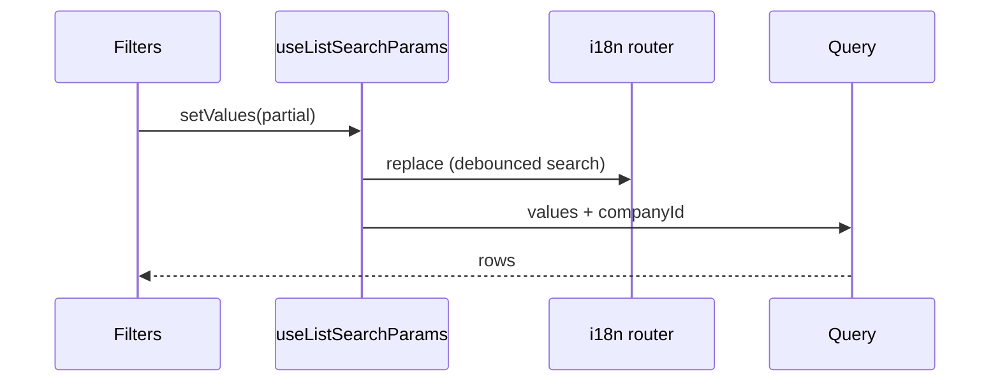

# Design: Frontend UX Foundation

## Technical Approach

URL is sole SoT for list filters/pagination/sort via shared client hook `useListSearchParams`: `useSearchParams` + locale-aware `router.replace` (`@/i18n/navigation`), Zod parse/serialize, **no nuqs**. `companyId` stays global (`useCompanyStore` injected at query time). Icon-only controls get i18n `aria-label` (exclude integrations). Presentation-only; domain/application ports unchanged.

## Architecture Decisions

| Decision | Options | Tradeoff | Choice |
|----------|---------|----------|--------|
| URL sync | nuqs / manual / dual Zustand+URL | Dep vs custom vs dual-SoT | Manual hook (locked) |
| Inventory filters | Keep in Zustand / URL only | Dual SoT if both | **Remove** filter fields/actions from store; keep selection + form UI |
| Arrays | repeat keys / CSV / JSON | Drift | **CSV** (`ids=a,b,c`); omit empty |
| Writes | push / replace+debounce | History spam | `replace` + 300ms on `debounceKeys` |
| Defaults | always / omit | Clutter | Omit keys equal to defaults |
| companyId | URL / global | Cross-company links | Global only |
| Schemas | shared-only / per-list | Coupling | Pure codec in shared; **Zod+defaults per list** beside list |
| Filter hooks | wrap URL / delete | API noise | Delete `use*Filters`; lists call shared hook |
| Integrations a11y | now / defer | meli conflict | Defer |
| Delivery | one PR / A→B→C | 400-line budget | Chained A→B→C |

## Ports / Adapters

| Layer | Impact |
|-------|--------|
| Domain / Application / HTTP adapters | None |
| Zustand `inventory.store` | Drop `*Filters` + setters/resets; `partialize` only `selectedWarehouseId` |
| Presentation | New hook+lib; migrate lists; UI a11y |

## Component Hierarchy

```
page.tsx (RSC) → Suspense → *List (client)
  ├── *Filters ← values / setValues
  ├── rows → Button size="icon" + aria-label
  └── TablePagination (+ aria-labels)
shared/presentation/{hooks/use-list-search-params.ts, lib/list-search-params.ts}
```

## Data Flow

```
URL ─useSearchParams─parse(Zod+defaults)─► values
                                              │
                         filtersWithCompany = { ...values, companyId? }
                                              ▼
                                         useQuery
setValues ─debounce search─serialize(omit defaults)─► router.replace(pathname+qs)
```



## Interfaces

```ts
// lib/list-search-params.ts (pure, unit-tested)
parseListParams(sp, schema, defaults): T
serializeListParams(values, defaults): URLSearchParams  // CSV arrays; omit default/empty

// hooks/use-list-search-params.ts
useListSearchParams({ schema, defaults, debounceKeys?, debounceMs? }): {
  values: T;
  setValues: (partial: Partial<T>) => void;
  reset: () => void;  // empty URL → defaults
}
```

Invalid Zod → fallback to defaults for that key; never throw. Caller resets `page: 1` when non-page filters change (existing list pattern).

## File Changes

| File | Action | Description |
|------|--------|-------------|
| `shared/presentation/lib/list-search-params.ts` | Create | Codec |
| `shared/presentation/hooks/use-list-search-params.ts` | Create | Hook |
| `shared/presentation/hooks/index.ts` | Modify | Export |
| `tests/shared/presentation/{lib,hooks}/*list-search-params.spec.ts` | Create | TDD |
| Per-list `*-list-params.ts` | Create | Zod + defaults |
| `inventory.store.ts`, `use-inventory-store.ts`, store spec | Modify | Remove filters |
| Inventory: product/warehouse/stock/category lists + filters | Modify | Hook + row a11y |
| Local lists: sale, return, transfer, movement, contact, user, brand, company, audit, combo (+ role if filtered) | Modify | useState → hook |
| `header.tsx`, `table-pagination.tsx` | Modify | aria-label |
| Other icon buttons excl. `integrations/**` | Modify | aria-label |
| List page RSC wrappers | Modify | Suspense if missing |

## Migration (chained)

| PR | Scope |
|----|--------|
| **A** | Codec+hook+tests; inventory store+4 lists; header/pagination a11y |
| **B** | Remaining lists |
| **C** | Remaining icon sweep (skip integrations) |

Empty URL → defaults; no localStorage filter migration.

## Testing (strict TDD)

| Layer | What |
|-------|------|
| Unit | Codec: CSV, omit defaults, invalid → defaults |
| Unit | Hook: debounce, replace not push, reset clears QS (mock searchParams/router) |
| Unit | Store: no filter persist keys |
| Component | product-list / sale-list URL drives filters; company injected |

## SSR / Hydration

- Wrap lists in `<Suspense>` (page) for `useSearchParams`.
- Skip replace on mount when serialized(values) === current QS.
- Read only searchParams (never `window`).
- Debounced `replace` only.

## Open Questions

- None blocking. Confirm role-list filter surface during apply (migrate or a11y-only).
